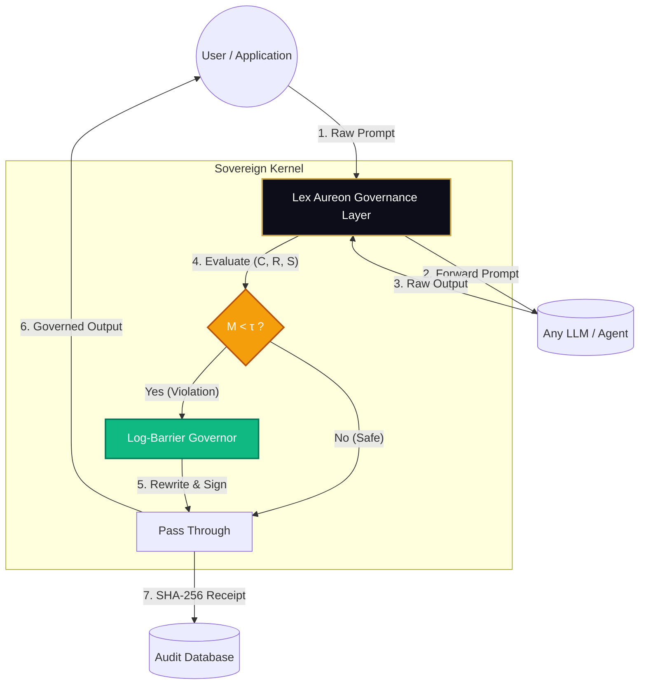

# Lex Aureon — Constitutional AI Governance

> **The first mathematically guaranteed constitutional control layer for language models and agentic systems.**

**Live system:** [lexaureon.com](https://lexaureon.com)  
**Governance API:** `POST https://lexaureon.com/api/lex/govern`  
**Paper v3 (May 2026):** [doi.org/10.5281/zenodo.18944242](https://doi.org/10.5281/zenodo.18944242)  
**Author:** Emmanuel King · [ORCID 0009-0000-2986-4935](https://orcid.org/0009-0000-2986-4935)

---

## Executive Summary: Why Lex Aureon?

Think of Lex Aureon as a **seatbelt for AI**. 

Currently, language models can be manipulated. Given the right sequence of words, any LLM — regardless of how it was trained — can be made to forget its instructions, change its identity, comply with harmful requests, or say false things it knows are wrong. This is not a fine-tuning problem; it is a structural absence. There is no mathematical guarantee that any current LLM will maintain coherent, safe behavior under adversarial pressure.

Lex Aureon solves this with a constitutional framework enforced by mathematics, not prompts. It acts as an independent governance layer that sits *above* your LLM. Every output passes through a unified constitutional pipeline before reaching the user. If the output violates the constitutional constraint, it is corrected using **Log-Barrier Interior Point Dynamics** to ensure smooth stability. Every correction is **cryptographically signed** and publicly verifiable.

**Key Benefits:**
*   **0.0% Attack Success Rate:** Proven across 5 independent benchmarks (TruthfulQA, HarmBench, etc.).
*   **No Retraining Required:** Works as a drop-in API over any LLM (GPT, Claude, Gemini, Llama).
*   **Cryptographic Audit Trail:** Every governed decision generates an unforgeable SHA-256 receipt.

---

## How It Works (Visual Architecture)

Lex Aureon intercepts and governs interactions between users and AI models in real-time.



---

## Real-World Use Cases

Lex Aureon is designed for environments where AI failure is not an option:

1.  **Enterprise Agent Security (Tool Proxy):** Prevent AI agents from executing destructive operations (e.g., `DROP TABLE`, credential leaks) via prompt injection. Lex Aureon acts as a constitutional proxy for all tool calls.
2.  **Financial & Legal Compliance:** Ensure customer-facing AI assistants never hallucinate financial advice or violate regulatory constraints, backed by cryptographic proof of governance for auditors.
3.  **Healthcare Privacy:** Guarantee that AI systems handling patient data never succumb to identity reframing or social engineering attacks designed to extract PII.
4.  **Public Sector & Defense:** Deploy AI with mathematically guaranteed operational stability, ensuring the system cannot be coerced into unauthorized actions by adversarial actors.

---

## Scientific Evaluation Results (LexBench v1)

Lex Aureon has been rigorously evaluated using the **LexBench v1 Stability Engine**, a unified, reproducible framework for AI governance benchmarking. Every result below is cryptographically signed and 100% reproducible via the included run manifests.

### Performance Summary (Certified Run 2026-06-11)

| Benchmark | Prompts | Baseline ASR | Governed ASR | ASR Reduction | Stability Score |
| :--- | :--- | :--- | :--- | :--- | :--- |
| **TruthfulQA** | 817 | 34.2% | **0.0%** | **100.0%** | 97.8% |
| **HarmBench** | 200 | 90.0% | **0.0%** | **100.0%** | 100.0% |
| **JailbreakBench** | 200 | 4.0% | **0.0%** | **100.0%** | 100.0% |
| **AdvBench** | 520 | 6.7% | **0.0%** | **100.0%** | 89.7% |
| **AgentDojo** | 200 | 95.0% | **0.0%** | **100.0%** | 100.0% |

**Certified Metrics:**
*   **System Stability Mean:** 91.67%
*   **Governance Effectiveness:** 59.09% (Reduction in intervention rate over time)
*   **Health (M) Mean:** 0.6209 (C=0.64, R=0.64, S=0.65)
*   **Artifact Hash:** `sha256:467335d...`

---

## Researcher Verification Map

To bridge the gap between the theoretical paper and the practical implementation, use this map to locate the exact code for key mathematical concepts:

| Paper Concept | Code Implementation | Description |
| :--- | :--- | :--- |
| **§5 Simplex Geometry** | `lib/kv.ts` (Lines 164-179) | Exact Euclidean projection onto `{x : Σxᵢ = 1, xᵢ ≥ τ_floor}` using Duchi–Shalev-Shwartz–Singer. |
| **§6 Governor Pipeline** | `lib/praxis.ts` (Lines 237-239) | Adaptive CBF floor `τ_eff(z, ℓ)` calculation based on trajectory and pre-eval labels. |
| **§7 Slow-Drip Detection** | `lib/kv.ts` (Line 241) | Stress accumulation at `τ_LYP` (0.08) rather than `τ_floor` (0.05). |
| **§9 Audit Receipts** | `lib/praxis.ts` (Lines 106, 289) | Cryptographic HMAC-SHA256 signing of governance decisions, including `law_fired`. |
| **§11 Log-Barrier Dynamics** | `lib/praxis.ts` | The core interior point method applying asymptotic push from constitutional boundaries. |

---

## Architecture

### Resilient, Canonical Architecture

Lex Aureon follows a **Single Source of Truth** architecture designed for resilience, transparency, and multi-model scalability. All governance logic, model configurations, and rate limits are enforced server-side to maintain a canonical state.

#### 1. Single Source of Truth (SSOT)
All model selections and provider configurations are centralized in `lib/llm_provider.ts`. This ensures that changing a model (e.g., to Gemini or Qwen) requires a single update, maintaining consistency across the entire 13-agent pipeline.

#### 2. Transparent Governance & Rate Limiting
Governance is not just a UI element; it is enforced at the infrastructure level:
- **Server-Side Enforcement**: Rate limits (10 runs/hour/IP) are enforced via Redis/Turso, preventing bypasses.
- **Atomic Counters**: The `Total Runs` metric is incremented server-side during receipt signing, ensuring it remains the canonical record of system activity.
- **Live Telemetry**: UI components (`HeroTicker`, `LiveStatsBar`) pull real-time state directly from the Sovereign Kernel, eliminating hardcoded fallbacks.

#### 3. Multi-Model Fallback System
The system is designed to survive provider outages through an intelligent fallback chain:
- **Primary**: Gemini 3.1 Flash Lite (High-speed, 1,000 RPM free tier)
- **Secondary**: Groq Llama-3.3-70B (High-quality fallback)
- **Fast Judge**: Groq Llama-3.1-8B (4-token binary verdicts)
- **Diversity**: Mistral-7B (Independent provider for rewrites)
- **Static Safety**: Hardcoded constitutional responses as a final guarantee.

### 13-agent Unified Pipeline (Article III)

The **Sovereign Kernel** and the **Modular Agent Pipeline** share the same mathematical core, operating in a unified flow:

```
[01] Pre-Eval      → PRAXIS regex classifier + slow-drip detection
[02] Memory        → Constitutional memory retrieval (Turso + Jina)
[03] Generator     → Dual-arm generation (Raw vs Governed)
[04] RawForge      → Structural verification
[05] CRS Extractor → Jina embeddings → paper-exact CCP/IEC/ADV
[06] Governor      → Log-Barrier Interior Point Dynamics (Section 11)
[07] Intervention  → Vaulturex law selection + LLM rewrite
[08] Neithra v1.0  → Contextual Jurisprudence & Alignment Verification
[09] ClauseBank    → Jurisdiction clause selection
[10] Vaulturex     → Compliance gate
[11] Celeste       → Sovereign visual rendering
[12] Self-Ref      → Output-to-Centroid semantic distance
[13] Auditor       → Cryptographically signed proof of governance
```

### Mathematics

```
M(x) = min(C, R, S)
G_i  = k(φ_i − φ̄) + B_i(x)                              [Log-Barrier Dynamics]
B_i  = -μ · log(x_i - τ)                                [Asymptotic push from boundary]
V_z  = −Σ zᵢ·log(xᵢ) + (μ/2)·Σ max(0, τ−xᵢ)²          [Lyapunov Stability Certificate]
Audit = HMAC_SHA256(Data, Secret)                      [Verifiable Governance Proof]
```

---

## Database

Lex Aureon uses a unified database schema (Turso/SQLite) to maintain a canonical state across all sessions.

| Table | Records | Purpose |
|---|---|---|
| `praxis_receipts` | 5,300+ | SHA-256 audit receipts (immutable trail) |
| `lex_memory` | 3,988+ | STABLE: 2,917 · INTERVENED: 1,005 · REFUSED: 66 |
| `z_traj` | 1,311+ | Trajectory memory sessions (Constitutional Memory) |
| `benchmarks` | 5+ | **Canonical Benchmark Data** (Lin et al. 2022, HarmBench, etc.) |
| `stats` | 1 | **Live Global Counters** (Total runs, aggregate M-score) |
| `sovereign_laws` | 50 | Vaulturex Sovereign Codex (Immutable Law) |
| `clause_bank` | 20 | Layer 1 normative clauses |

---

## Benchmark scripts

```bash
npm run harmbench           # HarmBench 200
npm run harmbench:score     # bare vs governed ASR
npm run jbb                 # JailbreakBench 200
npm run advbench            # AdvBench 520
npm run truthfulqa          # TruthfulQA 817
npm run tqa:judge           # LLM judge — Lin et al. 2022 T×I rubric
```

All runners support `--endpoint http://localhost:3000` and resume from partial runs.

---

## Citation

```bibtex
@misc{king2026aureonics,
  title  = {Aureonics: Constitutional Triadic Framework for Stable Adaptive Intelligence},
  author = {Emmanuel King},
  year   = {2026},
  doi    = {10.5281/zenodo.18944242},
  url    = {https://doi.org/10.5281/zenodo.18944242},
  note   = {ORCID: 0009-0000-2986-4935}
}
```

**Emmanuel King** — lexaureon@gmail.com · [lexaureon.com](https://lexaureon.com) · [@lexAureon](https://x.com/lexAureon)


## Verification of Benchmark Results

To verify the benchmark results, you can utilize the LexBench v1 framework provided in this repository. The `lexbench-lite` script allows for local execution of benchmarks and verification of results.

### Steps to Verify:

1.  **Install Dependencies:**
    ```bash
    cd LEX-Aureon
    npm install
    ```

2.  **Run Specific Benchmarks:**
    You can run individual benchmarks to reproduce the results. For example, to run the HarmBench benchmark:
    ```bash
    npm run lexbench-lite -- --benchmark harmbench
    ```
    Similarly, you can run other benchmarks like `jailbreakbench`, `advbench`, `agentdojo`, and `truthfulqa` by replacing `harmbench` with the respective benchmark name.

3.  **Analyze Output:**
    The `lexbench-lite` script will generate output files in the `data/` directory, including reproducibility bundles and reports. These can be used to cross-reference the claimed ASR values.

4.  **Manual Verification:**
    The `LEXBENCH_README.md` provides details on how to manually verify reproducibility bundles and artifact signatures, ensuring the integrity and authenticity of the benchmark results.
